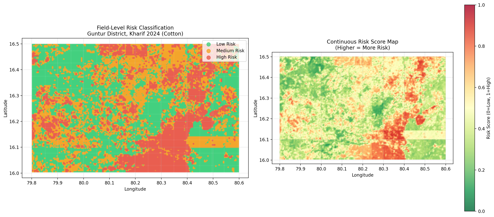
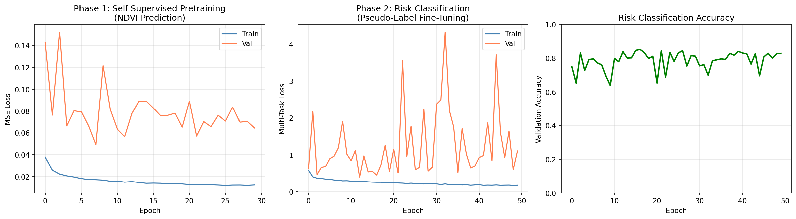
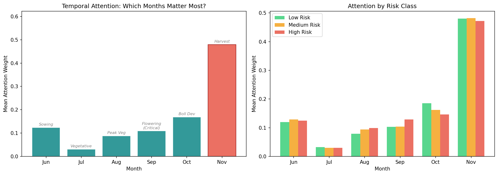
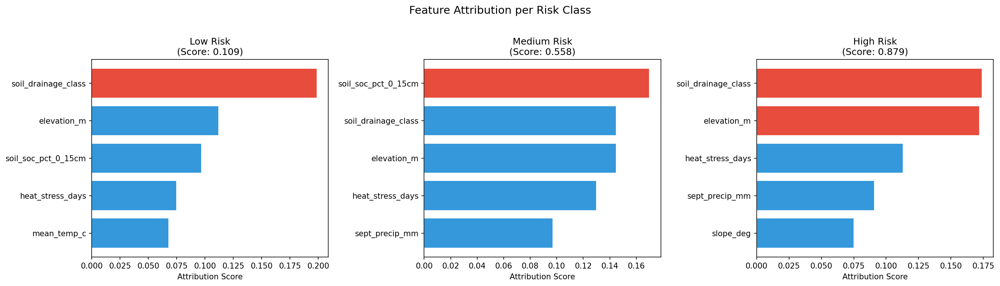
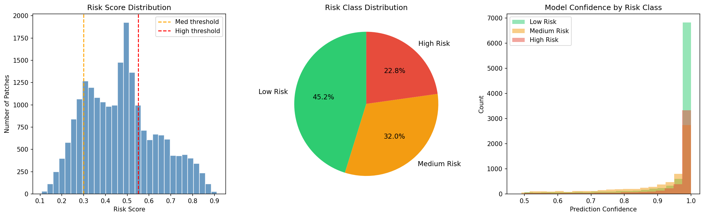

# 🛰️ Field-Level Risk Signal for Farmer Credit

**Geospatial Risk Modeling — SwanSAT Technical Assignment**

> A hybrid Deep Learning + Domain Knowledge system that classifies agricultural fields in Guntur district, Andhra Pradesh as **Low / Medium / High risk** for farmer credit scoring, using real Sentinel-2 and Sentinel-1 satellite imagery from Kharif 2024 (June–November).

---

## 📊 Key Results

| Metric | Value |
|--------|-------|
| **Patches Analyzed** | 21,275 (each 640m × 640m) |
| **Satellite Data** | 3.5 GB real imagery (Sentinel-2 + Sentinel-1) |
| **Validation Accuracy** | 85.2% |
| **Model Parameters** | 328K |
| **Training Time** | 32.5 min (NVIDIA L40S) |

### Risk Distribution

| Risk Class | Patches | Avg Score | Avg Confidence | Credit Action |
|------------|---------|-----------|----------------|---------------|
| 🟢 Low Risk | 9,618 (45.2%) | 0.325 | 0.947 | Auto-approve |
| 🟡 Medium Risk | 6,809 (32.0%) | 0.512 | 0.891 | Require crop insurance |
| 🔴 High Risk | 4,848 (22.8%) | 0.710 | 0.948 | Manual review |

---

## 🗺️ Risk Map



**Left:** Field-level risk classification showing spatial clustering — the northern zone (Krishna River basin) is predominantly Low Risk due to fertile alluvial soils, while the southern/southeastern zone shows High Risk concentration linked to poor drainage Vertisols and lower elevation.

**Right:** Continuous risk score heatmap revealing gradual risk transitions across the district.

---

## 🏗️ Architecture

```
                    ┌─────────────────────────────────────────────────────┐
                    │            INPUT: 6 months × 9 bands × 64×64       │
                    │     (B2, B3, B4, B8, B11, B12, NDVI, VV, VH)       │
                    └───────────────────────┬─────────────────────────────┘
                                            │
                    ┌───────────────────────▼─────────────────────────────┐
                    │         SPATIAL ENCODER (2D-CNN, shared weights)     │
                    │         3 blocks: 32→64→128 channels                │
                    │         Processes each month independently           │
                    │         Output: 128-dim embedding per month          │
                    └───────────────────────┬─────────────────────────────┘
                                            │
                              6 monthly embeddings (6 × 128)
                                            │
                    ┌───────────────────────▼─────────────────────────────┐
                    │         TEMPORAL ENCODER (1D-CNN + Attention)        │
                    │         Learns month-to-month growth patterns        │
                    │         Outputs: 64-dim embedding + attention weights│
                    └───────────────────────┬─────────────────────────────┘
                                            │
                    ┌───────────────────────▼─────────────────────────────┐
                    │              FUSION LAYER                            │
                    │   Temporal embedding (64) + Auxiliary features (20)  │
                    │   Weather / Soil / Elevation                         │
                    │   MLP: 84 → 64 → 32                                 │
                    └──────┬─────────────┬──────────────┬─────────────────┘
                           │             │              │
                    ┌──────▼──┐   ┌──────▼──────┐  ┌───▼────────┐
                    │ NDVI    │   │ Risk Class  │  │ Risk Score │
                    │ Predict │   │ Low/Med/High│  │   [0, 1]   │
                    │ (SSL)   │   │ (3-class)   │  │ (regress)  │
                    └─────────┘   └─────────────┘  └────────────┘
```

### Training Strategy (No Ground Truth)

Since no farmer repayment or yield data is available:

**Phase 1 — Self-Supervised Pretraining (30 epochs):** Mask a random month's data and predict its NDVI from the remaining 5 months + weather features. This teaches the model what normal crop growth trajectories look like.

**Phase 2 — Pseudo-Label Fine-Tuning (50 epochs):** Rule-based scoring generates risk labels from NDVI trajectory + weather anomalies + soil vulnerability. The DL model then learns spatial-temporal patterns beyond what rules can capture. Class imbalance handled via weighted loss + oversampling.

---

## 📈 Training Curves



- **Phase 1 (left):** Self-supervised NDVI prediction converges steadily. Train loss reaches 0.012.
- **Phase 2 (center):** Classification loss decreases with periodic val spikes — expected behavior with WeightedRandomSampler oversampling minority classes.
- **Phase 2 (right):** Validation accuracy stabilizes at 80–85%.

---

## ⏱️ Temporal Attention: Which Months Matter?



The model learned that **November (harvest, 47.9%)** and **October (boll development, 16.9%)** are the most predictive months. This makes agronomic sense — crop condition at harvest time is the strongest indicator of yield outcome.

For **High Risk** patches, September (flowering) receives elevated attention — consistent with the understanding that water stress during cotton flowering causes irreversible yield loss.

---

## 🔍 Feature Attribution: What Drives Risk?



Top risk drivers across all classes:
- **Soil drainage class** — Poor drainage (Vertisols) amplifies waterlogging risk
- **Elevation** — Low-lying areas are flood-prone
- **Heat stress days** — Days >38°C during flowering cause boll shedding
- **September precipitation** — Deficit during flowering is critical for cotton

---

## 📊 Risk Score Distribution



- **Left:** Continuous risk score histogram with classification thresholds
- **Center:** 45/32/23% class distribution — realistic for a single season
- **Right:** Model confidence is high (>0.9) across all classes

---

## ☁️ Handling Cloud Cover

A critical real-world challenge: **July and August had 70–74% optical data loss** from monsoon clouds.

```
Month    S2 Valid    S1 Valid    Strategy
Jun      97.1%       ~98%       Optical primary
Jul      26.4%       ~98%       ← SAR carries the signal
Aug      30.8%       ~98%       ← SAR carries the signal
Sep      59.8%       ~98%       Mixed: optical + SAR
Oct      99.1%       ~98%       Optical primary
Nov      97.7%       ~98%       Optical primary
```

Our 9-band input (7 optical + 2 SAR) ensures the model always has valid radar data. The temporal attention mechanism automatically learned to downweight cloud-affected months (July: 3.1% attention).

---

## 🏦 Credit Decision Workflow

```
Farmer applies for loan (provides farm location)
                    │
                    ▼
        ┌──────────────────────┐
        │ AUTOMATED RISK       │
        │ ASSESSMENT           │
        │ • Satellite imagery  │
        │ • Weather analysis   │
        │ • Soil/terrain data  │
        │ • DL risk score      │
        │ • Explanation        │
        └──────────┬───────────┘
                   │
        ┌──────────▼───────────┐
        │ DECISION ROUTING     │
        │                      │
        │ LOW    → Auto-approve│
        │ MEDIUM → + Insurance │
        │ HIGH   → Manual review│
        └──────────────────────┘
```

Updated every **5 days** (Sentinel-2 revisit cycle) for portfolio monitoring.

---

## 📂 Project Structure

```
SwanSAT_Assignment/
│
├── approach_document.pdf              # 3-page approach document
│
├── scripts/                           # Pipeline scripts (run in order)
│   ├── 01_download_satellite.py       # Downloads S2 + S1 via Google Earth Engine
│   ├── 02_preprocess_patches.py       # Raster → patches, normalization, pseudo-labels
│   ├── 03_train_model.py              # Self-supervised pretraining + classification
│   ├── 04_inference.py                # Risk scores + explainability (GPU)
│   ├── 05_visualize.py                # Maps, attention plots, training curves
│   ├── train_model.sbatch             # SLURM job script for training (GPU)
│   └── inference.sbatch               # SLURM job script for inference (GPU)
│
├── src/                               # Model architecture and utilities
│   ├── __init__.py
│   ├── model.py                       # CropRiskEncoder (328K params)
│   ├── dataset.py                     # PyTorch Dataset with masking + augmentation
│   └── explainability.py              # Grad-CAM, temporal attention, attribution
│
├── outputs/                           # All generated results
│   ├── risk_map_static.png            # Spatial risk classification map
│   ├── risk_distribution.png          # Score histogram, pie chart, confidence
│   ├── temporal_attention.png         # Which months matter most
│   ├── training_curves.png            # Loss and accuracy over training
│   ├── feature_importance.png         # Which auxiliary features drive predictions
│   ├── risk_scores.csv                # 21,275 rows with lat/lon/score/class
│   ├── risk_map.html                  # Interactive folium map
│   └── sample_explanations.json       # Human-readable per-patch explanations
│
├── data/                              # Input data
│   ├── satellite/                     # 12 GeoTIFFs, ~3.5 GB (generated by Script 01)
│   ├── patches/                       # Preprocessed tensors (generated by Script 02)
│   ├── weather_data.csv               # 1,647 rows: daily weather, 9 stations
│   ├── weather_longterm_daily.csv     # 2015–2023 baseline for anomaly computation
│   ├── soil_data.csv                  # 64 points: clay, sand, SOC, pH, drainage
│   ├── elevation_data.csv             # 225 points: SRTM elevation + slope
│   └── guntur_boundary.geojson        # District boundary polygon
│
├── models/                            # Trained weights (generated by Script 03)
│   ├── pretrained_encoder.pth         # Self-supervised pretrained weights
│   ├── risk_model.pth                 # Final classification model
│   └── training_log.json              # Training history and config
│
├── data.py                            # Initial data download (weather, soil, elevation)
├── soil.py                            # Soil data fallback (SoilGrids API was down)
├── vis.ipynb                          # Exploratory analysis notebook (patch visualization)
├── guntur_verification_map.html       # Interactive map verifying study area coverage
├── requirements.txt                   # Python dependencies
└── README.md                          # This file
```

> **Note:** `data/satellite/` and `data/patches/` are excluded from the repo due to size (~21 GB combined). They are fully reproducible by running Scripts 01 and 02.

---

## 🚀 Quick Start

### Prerequisites

- Python 3.10+
- Google Earth Engine account → [signup](https://earthengine.google.com/signup/)
- GPU with ≥16GB VRAM (trained on NVIDIA L40S)

### Setup

```bash
git clone https://github.com/YOUR_USERNAME/swansat-assignment.git
cd swansat-assignment
pip install -r requirements.txt

# One-time GEE authentication
earthengine authenticate --auth_mode=notebook
```

### Run the Full Pipeline

```bash
# Step 1: Download real satellite imagery (~20-40 min, needs internet)
python scripts/01_download_satellite.py

# Step 2: Preprocess into patches (~10 min, CPU)
python scripts/02_preprocess_patches.py

# Step 3: Train model (GPU required)
# Via SLURM:
sbatch scripts/train_model.sbatch
# Or directly:
python scripts/03_train_model.py

# Step 4: Run inference (GPU required)
# Via SLURM:
sbatch scripts/inference.sbatch
# Or directly:
python scripts/04_inference.py

# Step 5: Generate all visualizations (~2 min, CPU)
python scripts/05_visualize.py
```

---

## 📡 Data Sources

| Source | Resolution | Access | Auth Required? |
|--------|-----------|--------|----------------|
| [Sentinel-2 L2A](https://developers.google.com/earth-engine/datasets/catalog/COPERNICUS_S2_SR_HARMONIZED) | 10m, 6 months | Google Earth Engine | Yes (free) |
| [Sentinel-1 GRD](https://developers.google.com/earth-engine/datasets/catalog/COPERNICUS_S1_GRD) | 10m, 6 months | Google Earth Engine | Yes (free) |
| [Open-Meteo ERA5](https://open-meteo.com/en/docs/historical-weather-api) | Daily | REST API | No |
| [SRTM DEM](https://www.opentopodata.org/datasets/srtm/) | 30m | REST API | No |
| [geoBoundaries](https://www.geoboundaries.org/) | District level | REST API | No |

---

## ⚠️ Known Limitations

1. **No crop type mask:** All land cover is processed. Production system needs NDVI phenology matching or FASAL crop maps to isolate cotton.
2. **Patch-level, not field-level:** 640m patches contain multiple fields. True field delineation requires cadastral data or SAM segmentation.
3. **No ground truth validation:** Risk predictions cannot be verified against actual yield/repayment data.
4. **Single season:** Cannot distinguish one-off anomalies from chronic multi-year risk patterns.
5. **Grad-CAM spatial heatmaps:** Current implementation captures only final time-step activations. Per-month isolation is a planned improvement.

---

## 🔮 Future Improvements

- **Crop classification pre-filter** using NDVI temporal phenology (cotton peaks Aug–Sep vs rice earlier)
- **Field boundary segmentation** via Segment Anything Model (SAM) on NDVI
- **Multi-season stacking** (3–5 Kharif seasons) for chronic risk identification
- **Daily temporal resolution** with Temporal Transformer replacing 1D-CNN
- **Integration with Soil Health Card** portal data when API is available
- **Calibration loop:** Post-season comparison with actual yield/repayment outcomes

---

## 📄 License

This project was created as a technical assignment submission. All satellite data is from ESA Copernicus (open access). Weather data from Open-Meteo (CC BY 4.0).
