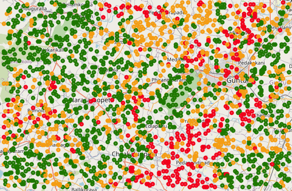
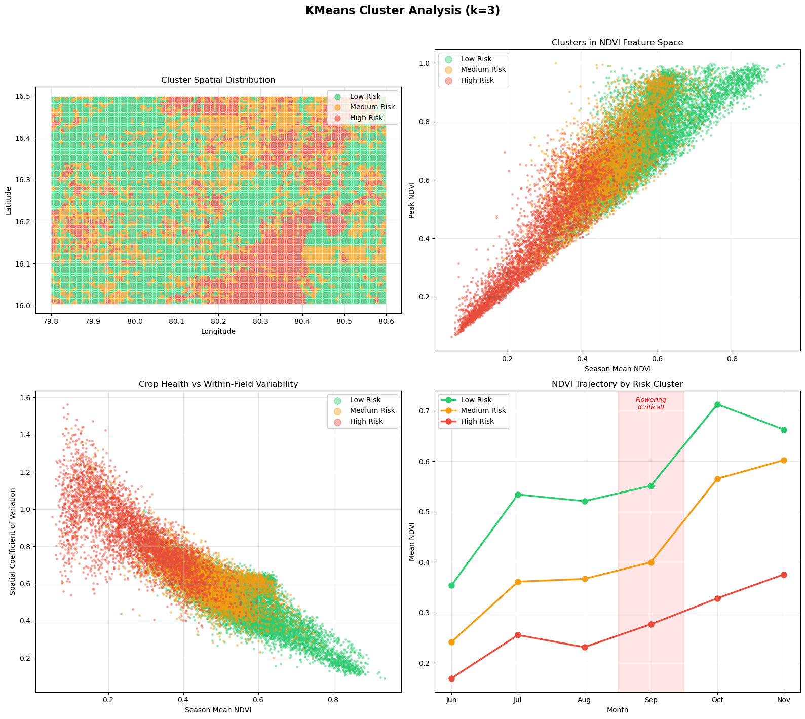

# 🛰️ Field-Level Risk Signal for Farmer Credit

> **A hybrid Deep Learning + Unsupervised Clustering system for agricultural risk assessment using real Sentinel-2 and Sentinel-1 satellite imagery — built for farmer credit scoring in Guntur district, Andhra Pradesh.**

[](https://python.org)
[](https://pytorch.org)
[](LICENSE)

---

## 🎯 Problem

Banks and microfinance institutions need to assess crop loan risk before approving loans to farmers. Traditional methods require physical field visits — expensive and unscalable. This system uses **satellite imagery + weather + soil data** to automatically classify every agricultural patch in a district as Low, Medium, or High risk, enabling data-driven credit decisions at scale.

**Study Area:** Guntur District, Andhra Pradesh (cotton-dominant, Kharif 2024)

---

## 📊 Results at a Glance

| Metric | Value |
|--------|-------|
| **Patches Analyzed** | 21,275 (each 640m × 640m, ~41 hectares) |
| **Satellite Data Processed** | 3.5 GB (12 GeoTIFFs from Sentinel-2 + Sentinel-1) |
| **Validation Accuracy** | 84.2% |
| **Model Size** | 328K parameters |
| **Training Time** | 24.7 minutes (NVIDIA L40S) |

### Risk Distribution

| Risk Class | Patches | Avg Score | Confidence | Credit Action |
|------------|---------|-----------|------------|---------------|
| 🟢 **Low Risk** | 11,122 (52.3%) | 0.333 | 0.957 | Auto-approve, standard rate |
| 🟡 **Medium Risk** | 6,658 (31.3%) | 0.510 | 0.891 | Approve with crop insurance |
| 🔴 **High Risk** | 3,495 (16.4%) | 0.679 | 0.934 | Manual review, adjusted terms |

---

## 🗺️ Risk Maps

### Static Risk Map


**Left:** Field-level risk classification across Guntur's core agricultural zone (89 km × 56 km). The northern zone (Krishna River basin) is predominantly **Low Risk** — fertile alluvial soils with sustained crop growth. The southern/southeastern zone shows **High Risk** concentration — lower elevation, poor-drainage Vertisols, and crop stress visible in satellite imagery during the critical flowering period.

**Right:** Continuous risk score heatmap showing smooth risk transitions. The gradient from green (north) to red (south) reflects the district's agro-ecological zonation.

### Interactive Map (with OpenStreetMap)


*The interactive HTML map (`outputs/risk_map.html`) overlays risk classifications on OpenStreetMap, allowing zoom and click for per-patch details.*

---

## 🏗️ System Architecture

```
                         SATELLITE IMAGERY (3.5 GB)
         ┌──────────────────────┬──────────────────────┐
         │   Sentinel-2 (10m)   │   Sentinel-1 (10m)   │
         │   7 optical bands    │   VV + VH (SAR)       │
         │   Cloud-masked       │   Cloud-free ✓        │
         └──────────┬───────────┴──────────┬────────────┘
                    │     9 bands/month     │
                    └──────────┬────────────┘
                               ▼
                    ┌─────────────────────┐
                    │  64×64 pixel patches │
                    │  (6 months × 9 bands)│
                    └──────────┬──────────┘
                               │
              ┌────────────────┼────────────────┐
              ▼                ▼                 ▼
    ┌──────────────┐  ┌───────────────┐  ┌────────────────┐
    │ SPATIAL CNN   │  │ TEMPORAL CNN  │  │ AUX FEATURES   │
    │ 2D-CNN        │  │ 1D-CNN +      │  │ Weather (7)    │
    │ per month     │  │ Attention     │  │ Soil (8)       │
    │ (shared)      │  │ over 6 months │  │ Elevation (2)  │
    │ → 128-dim     │  │ → 64-dim      │  │ → 20-dim       │
    └──────┬───────┘  └──────┬────────┘  └───────┬────────┘
           └─────────────────┼───────────────────┘
                             ▼
                    ┌─────────────────┐
                    │  FUSION + MLP   │
                    │  84 → 64 → 32   │
                    └────────┬────────┘
                             │
              ┌──────────────┼──────────────┐
              ▼              ▼              ▼
        ┌──────────┐  ┌──────────┐  ┌──────────┐
        │ Risk     │  │ Risk     │  │ NDVI     │
        │ Class    │  │ Score    │  │ Predict  │
        │ L/M/H    │  │ [0, 1]  │  │ (SSL)    │
        └──────────┘  └──────────┘  └──────────┘
```

---

## 🔬 Pseudo-Label Generation: Unsupervised Clustering

A key challenge: **no ground-truth risk labels exist** (no farmer repayment or yield data). Instead of hand-tuning a formula with arbitrary weights, we use a fully data-driven approach:

1. **Extract 21 features** from satellite patches: NDVI trajectory (mean, peak, decline rate, timing, spatial CV, temporal std), SAR backscatter statistics, seasonal growth ratios
2. **Combine with 8 auxiliary features**: rainfall anomaly, dry spells, heat stress, soil drainage, elevation
3. **KMeans clustering (k=3)** on the standardized 29-dimensional feature space — finds natural groupings
4. **Rank clusters by NDVI**: healthiest cluster → Low Risk, weakest → High Risk

The **only domain assumption** is that healthier vegetation = lower crop risk — universally accepted in agronomic literature.

### Cluster Analysis


**Key findings from the clustering:**

- **Top-left:** Clear spatial coherence — Low Risk dominates the northern Krishna River basin; High Risk concentrates in the southern poor-drainage zone. The clusters aren't random noise.
- **Top-right:** Clean separation in NDVI feature space — three distinct groups along the crop health axis.
- **Bottom-left:** Stressed patches (low NDVI) also show high spatial heterogeneity — mixed healthy/dead pixels within a single patch, indicating localized damage patterns.
- **Bottom-right:** NDVI trajectories per cluster diverge most during **September–November** (flowering to harvest), confirming the clusters capture real agronomic differences, not just noise.

---

## 🧠 Training Strategy

### Phase 1: Self-Supervised Pretraining (30 epochs)
Mask a random month's data → predict its NDVI from the remaining 5 months + weather. No labels needed. Teaches the model what "normal" crop growth looks like.

### Phase 2: Cluster-Label Fine-Tuning (50 epochs)
Train on KMeans-derived labels with class-weighted loss + oversampling for the minority High Risk class.

### Training Curves


- **Phase 1 (left):** Self-supervised NDVI prediction converges steadily. Train MSE reaches 0.013.
- **Phase 2 (center):** Classification loss decreases smoothly. Val loss is higher due to weighted sampling presenting harder batches.
- **Phase 2 (right):** Validation accuracy climbs from ~40% to **84.2%**, stabilizing after epoch 25.

---

## ⏱️ Temporal Attention: Which Months Matter?


The model learned that **November (harvest, 55.6%)** is the most predictive month — crop condition at harvest time is the strongest indicator of seasonal outcome. This makes agronomic sense: by November, all stress events (drought, heat, flooding) have manifested in the final crop state.

**Per-class breakdown (right):** High Risk patches show relatively elevated attention on early months (Jun) compared to Low Risk, suggesting the model detects early-season establishment failures.

---

## 🔍 Feature Attribution


**What drives risk predictions across different classes:**

| Feature | Low Risk | Medium Risk | High Risk |
|---------|----------|-------------|-----------|
| Slope | High importance | - | - |
| Soil drainage | Important | Very high | Important |
| Soil SOC | - | Important | Important |
| Elevation | - | - | Highest importance |
| Soil fertility | - | Important | - |

**Key insight:** Structural factors (drainage, elevation, slope) dominate across all classes. For **High Risk**, elevation is the top driver — low-lying areas face compounding flood and waterlogging risk.

---

## 📊 Risk Score Distribution


- **Left:** Continuous risk scores span the full [0.15, 0.85] range with a slight left skew — most patches are relatively healthy, but a meaningful tail extends into high-risk territory.
- **Center:** 52.3% / 31.3% / 16.4% distribution — realistic for a single Kharif season.
- **Right:** Model confidence exceeds 0.9 for >80% of predictions. Low Risk has highest confidence (0.957), Medium Risk lowest (0.891) — expected, as boundary cases are hardest to classify.

---

## ☁️ Handling Monsoon Cloud Cover

A critical real-world challenge: **July and August had 70–74% optical data loss** from monsoon clouds.

```
Month    Sentinel-2     Sentinel-1     Strategy
         (Optical)      (SAR)
───────────────────────────────────────────────
Jun      97.1% valid    ~98% valid     Optical primary
Jul      26.4% valid    ~98% valid     ← SAR fills the gap
Aug      30.8% valid    ~98% valid     ← SAR fills the gap  
Sep      59.8% valid    ~98% valid     Optical + SAR fusion
Oct      99.1% valid    ~98% valid     Optical primary
Nov      97.7% valid    ~98% valid     Optical primary
```

Our 9-band input (7 optical + 2 SAR) ensures the spatial encoder always receives valid radar data. The temporal attention mechanism learned to downweight the cloud-affected months automatically (Jul: 7.3% vs Nov: 55.6%).

---

## 🏦 Credit Decision Workflow

```
  Farmer applies for crop loan
  (provides farm GPS location)
              │
              ▼
  ┌───────────────────────────────┐
  │   RISK ASSESSMENT SYSTEM      │
  │                               │
  │   Satellite → Crop health     │
  │   Weather  → Env stress       │
  │   Soil     → Vulnerability    │
  │   DL Model → Risk score       │
  │   + Explanation (why?)        │
  └───────────────┬───────────────┘
                  │
    ┌─────────────┼─────────────┐
    ▼             ▼             ▼
  LOW RISK    MED RISK     HIGH RISK
  Auto-       Approve +    Manual
  approve     insurance    review
```

**Portfolio monitoring:** Updated every 5 days (Sentinel-2 revisit cycle). Early-warning alerts trigger if a field's NDVI deviates >2σ from predicted trajectory.

---

## 📂 Project Structure

```
SwanSAT_Assignment/
│
├── approach_document.pdf              # 3-page approach document
│
├── scripts/                           # Pipeline scripts (run in order)
│   ├── 01_download_satellite.py       # Downloads S2 + S1 via Google Earth Engine
│   ├── 02_preprocess_patches.py       # Raster → patches + KMeans clustering
│   ├── 03_train_model.py              # Self-supervised pretraining + classification
│   ├── 04_inference.py                # Risk scores + explainability (GPU)
│   ├── 05_visualize.py                # Maps, attention plots, training curves
│   ├── train_model.sbatch             # SLURM job for training (GPU)
│   └── inference.sbatch               # SLURM job for inference (GPU)
│
├── src/                               # Model architecture
│   ├── model.py                       # CropRiskEncoder (328K params)
│   ├── dataset.py                     # PyTorch Dataset with masking + augmentation
│   └── explainability.py              # Grad-CAM, temporal attention, attribution
│
├── outputs/                           # All generated results
│   ├── risk_map_static.png            # Spatial risk classification map
│   ├── risk_distribution.png          # Score histogram + pie chart
│   ├── temporal_attention.png         # Which months matter most
│   ├── training_curves.png            # Loss and accuracy curves
│   ├── feature_importance.png         # Feature attribution per class
│   ├── cluster_analysis.png           # KMeans cluster visualization
│   ├── risk_scores.csv                # 21,275 rows with coordinates + scores
│   ├── risk_map.html                  # Interactive folium map
│   └── sample_explanations.json       # Per-patch explanations
│
├── data/                              # Input data
│   ├── satellite/                     # 12 GeoTIFFs (~3.5 GB, generated by Script 01)
│   ├── patches/                       # Tensors (~18 GB, generated by Script 02)
│   ├── weather_data.csv               # Daily weather, 9 stations, 183 days
│   ├── weather_longterm_daily.csv     # 2015–2023 baseline
│   ├── soil_data.csv                  # 64-point soil properties grid
│   ├── elevation_data.csv             # 225-point SRTM elevation + slope
│   └── guntur_boundary.geojson        # District boundary
│
├── models/                            # Trained weights
│   ├── pretrained_encoder.pth         # Phase 1 weights
│   ├── risk_model.pth                 # Phase 2 weights
│   └── training_log.json              # Full training history
│
├── data.py                            # Weather/elevation/boundary download
├── soil.py                            # Soil data fallback (SoilGrids was down)
├── vis.ipynb                          # Exploratory notebook
├── requirements.txt
└── README.md
```

> **Note:** `data/satellite/` and `data/patches/` are excluded from the repo (~21 GB). Fully reproducible via Scripts 01 and 02.

---

## 🚀 Reproduction

### Prerequisites
- Python 3.10+ | PyTorch 2.0+ | Google Earth Engine account ([signup](https://earthengine.google.com/signup/))
- GPU with ≥16GB VRAM (trained on NVIDIA L40S 48GB)

### Setup
```bash
git clone https://github.com/YOUR_USERNAME/swansat-assignment.git
cd swansat-assignment
pip install -r requirements.txt
earthengine authenticate --auth_mode=notebook
```

### Run
```bash
# Step 1: Download satellite imagery (~30 min, needs internet)
python scripts/01_download_satellite.py

# Step 2: Preprocess + cluster (~10 min, CPU)
python scripts/02_preprocess_patches.py

# Step 3: Train (GPU)
sbatch scripts/train_model.sbatch       # or: python scripts/03_train_model.py

# Step 4: Inference (GPU)  
sbatch scripts/inference.sbatch          # or: python scripts/04_inference.py

# Step 5: Visualize (CPU, ~2 min)
python scripts/05_visualize.py
```

---

## 📡 Data Sources

| Source | Resolution | Variables | Access |
|--------|-----------|-----------|--------|
| [Sentinel-2 L2A](https://developers.google.com/earth-engine/datasets/catalog/COPERNICUS_S2_SR_HARMONIZED) | 10m, monthly | B2,B3,B4,B8,B11,B12,NDVI | GEE (free) |
| [Sentinel-1 GRD](https://developers.google.com/earth-engine/datasets/catalog/COPERNICUS_S1_GRD) | 10m, monthly | VV, VH | GEE (free) |
| [Open-Meteo ERA5](https://open-meteo.com/) | Daily, 9 pts | Temp, rain, ET0, humidity | REST API |
| [SRTM DEM](https://opentopodata.org/) | 30m | Elevation, slope | REST API |
| [geoBoundaries](https://geoboundaries.org/) | Admin-2 | District polygon | REST API |

---

## ⚠️ Known Limitations & Future Work

| Limitation | Impact | Future Solution |
|-----------|--------|-----------------|
| No crop type mask | Urban/water/non-cotton included | NDVI phenology matching or FASAL crop maps |
| Patch-level (640m) | Multiple fields per patch | SAM segmentation for field boundaries |
| No ground truth | Can't validate vs actual defaults | Calibrate with yield/repayment data |
| Single season | No chronic risk detection | Multi-year analysis (3–5 Kharif seasons) |
| Grad-CAM uniform | Hook captures only last time step | Per-month forward pass isolation |
| November attention dominance | Model may over-rely on harvest state | Add phenology-aware attention constraints |

---

## 📄 License

Technical assignment submission. Satellite data: ESA Copernicus (open access). Weather: Open-Meteo (CC BY 4.0).
